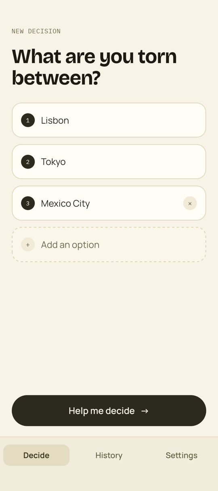
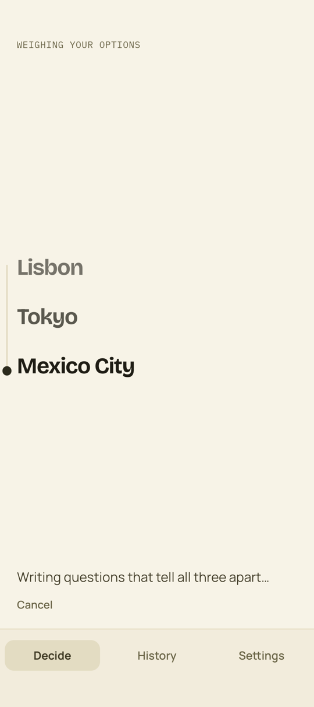
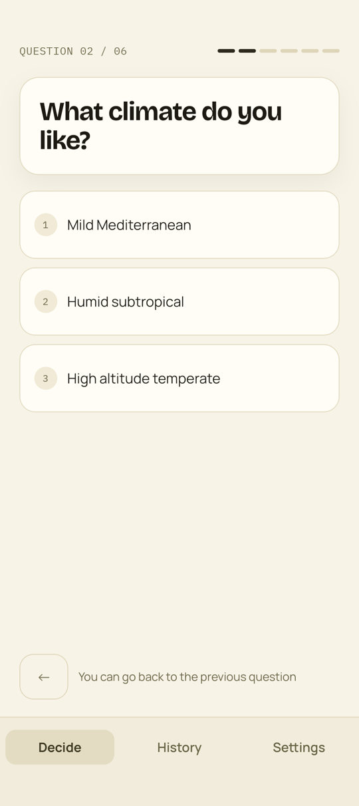
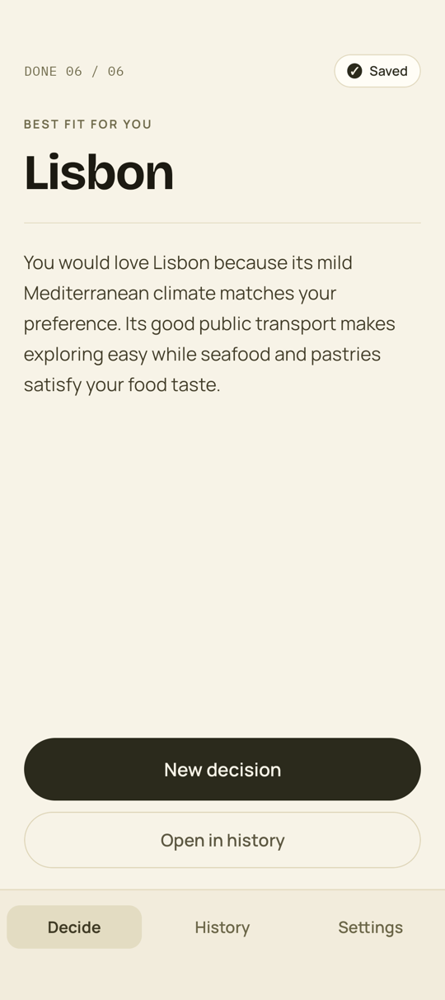
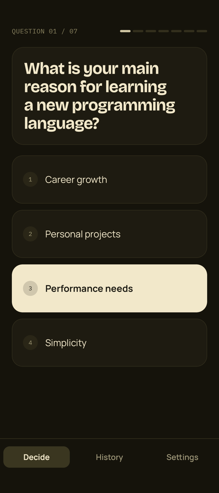
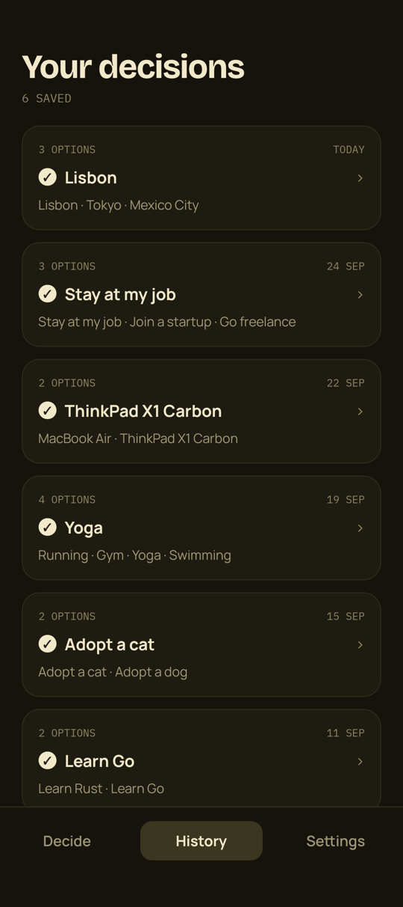
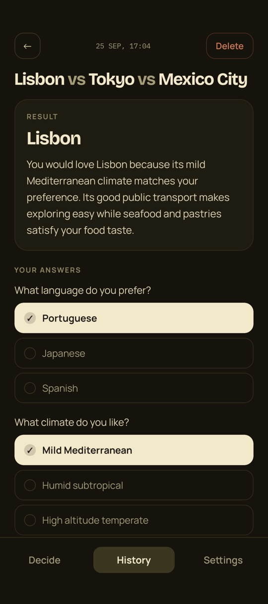
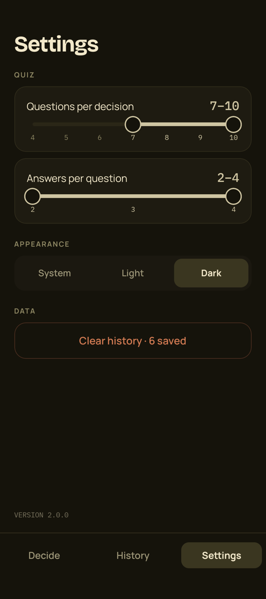

# PickAI 🤖

**AI-powered decision making assistant**

Torn between two to four options? PickAI asks you a few multiple-choice questions written by AI for your exact dilemma. Then it picks the option that fits your answers best and explains why.

[](https://play.google.com/store/apps/details?id=com.pickai)

## 📱 Screenshots

| New decision | Weighing your options | Question | Result |
| :---: | :---: | :---: | :---: |
|  |  |  |  |

| Question, dark theme | History | Saved decision | Settings |
| :---: | :---: | :---: | :---: |
|  |  |  |  |

## ✨ How It Works

1. **Enter your options** - List two to four things you're choosing between
2. **Answer AI questions** - Respond to 4-10 multiple-choice questions written to tell your options apart (7-10 by default)
3. **Get your best fit** - PickAI chooses one option and explains why in two or three sentences. The decision is saved to history together with your answers

## 🚀 Features & Functionality

### User Experience
- **2-4 options** per decision
- **Adjustable quiz** - Set the number of questions per decision (4-10) and answers per question (2-4)
- **Change your mind** - Step back to the previous question and pick another answer
- **History** - Every decision is saved automatically with the questions, your answers and the explanation. Delete one with a long press or from its details, or clear them all in Settings
- **Pick up where you left off** - An unfinished quiz or an unseen result is restored after the app restarts
- **Light, dark or system theme**
- **Reduced motion** - Looping and slide animations turn off when Android's "Remove animations" setting is on
- **Graceful failures** - Cancel a slow request, retry it, or go back to your options without retyping them

### Under the Hood
- **Model racing** - Each request goes to all configured OpenRouter models at once. The first valid response wins and the other requests are aborted (`Promise.any` + `AbortController`, 60-second overall timeout)
- **Structured outputs with a fallback** - At startup the app checks which models support structured outputs and sends them a strict JSON Schema, in which the winner is an `enum` of your options. Other models get the format in the prompt. Every response is validated before it is shown
- **Remote configuration** - The model list, the OpenRouter key and the ads switch come from Firebase Remote Config, so models can be swapped without an app update
- **Failure analytics** - Firebase Analytics records which model failed and why (HTTP status, invalid format, failed validation) and why a whole request failed (timeout, no models, every model failed)
- **Persisted state** - Zustand stores saved to AsyncStorage: settings, history (with a versioned migration from the old two-option format) and the quiz in progress, which becomes the initial navigation state on launch
- **Ads** - Appodeal banner under the tab bar and interstitials, switched on remotely
- **Custom design system** - Light and dark color tokens, Bricolage Grotesque, Manrope and IBM Plex Mono fonts, and hand-built range sliders, segmented control, dialogs and tab bar

## 🧱 Architecture

- **Services are thin facades** - `src/services` wraps OpenRouter, Firebase and Appodeal. Services hold no state, don't import each other and contain no business logic
- **Logic lives in hooks** - Prompts, JSON schemas, response parsing and the model fan-out sit next to the screen that needs them (`QuizScreen/useQuiz/useAIRequests`). Hooks shared by several screens or used by `App` live in `src/hooks`
- **Screen folders mirror imports** - A module that imports other local modules becomes a folder with an `index.ts` and keeps those modules inside. Leaf modules stay plain files
- **Navigation** - React Navigation 7 static API: bottom tabs with a custom tab bar, and native stacks with fade transitions inside the Decide and History tabs

## 🛠 Tech Stack

- React Native 0.80 (New Architecture, Hermes), React 19
- TypeScript
- Zustand 5 + Immer, AsyncStorage
- React Navigation 7
- OpenRouter API
- Firebase Remote Config & Analytics
- Appodeal
- Jest
- GitHub Actions + fastlane

## 🏗 Project Structure

```
src/
├── App.tsx
├── appTypes/        # Shared types and type guards
├── components/      # Shared UI: buttons, dialog, container, tab bar
├── constants/       # Colors, typography, strings, layout, Remote Config defaults
├── hooks/           # App-wide hooks: init, theme, quiz restore, animations
├── navigation/      # Navigators
│   └── screens/     # A folder per screen with its components and hooks
├── services/        # Facades over OpenRouter, Firebase and Appodeal
├── store/           # Zustand stores
└── tools/           # Pure helpers
__tests__/           # Jest unit tests
docs/screenshots/    # Images for this README
```

## 🧑‍💻 Development

PickAI is built for Android. Set up the [React Native environment](https://reactnative.dev/docs/set-up-your-environment) for Android (Node 18+, JDK 17), then:

```sh
npm install
cp .env.example .env   # add OPEN_ROUTER_API_KEY and APPODEAL_APP_KEY
npm start              # Metro
npm run android        # build and install the debug app
```

Run the unit tests for hooks, stores, services and response parsing:

```sh
npm test
```

### Release

```sh
npm version patch      # or minor / major
git push origin main --tags
```

`npm version` bumps `package.json`, syncs `versionName` and increments `versionCode` in `android/app/build.gradle`, then commits and tags `vX.Y.Z`. Pushing a `v*` tag starts GitHub Actions: fastlane builds a signed AAB and uploads it to the Google Play internal track.

## 📄 License

**Proprietary License**

Copyright (c) 2025 PickAI. All rights reserved.

This project is provided **for reference and educational purposes only**.

### Terms and Conditions

**Prohibited:**
- ❌ Commercial use
- ❌ Distribution or sale
- ❌ Creating derivative works
- ❌ Code modification
- ❌ Redistribution in any form

**Permitted:**
- ✅ Viewing the source code
- ✅ Studying for educational purposes
- ✅ Personal reference

### Disclaimer

THE SOFTWARE IS PROVIDED "AS IS", WITHOUT WARRANTY OF ANY KIND, EXPRESS OR IMPLIED, INCLUDING BUT NOT LIMITED TO THE WARRANTIES OF MERCHANTABILITY, FITNESS FOR A PARTICULAR PURPOSE AND NONINFRINGEMENT. IN NO EVENT SHALL THE AUTHORS OR COPYRIGHT HOLDERS BE LIABLE FOR ANY CLAIM, DAMAGES OR OTHER LIABILITY, WHETHER IN AN ACTION OF CONTRACT, TORT OR OTHERWISE, ARISING FROM, OUT OF OR IN CONNECTION WITH THE SOFTWARE OR THE USE OR OTHER DEALINGS IN THE SOFTWARE.

For commercial licensing inquiries, please contact the copyright holder.
